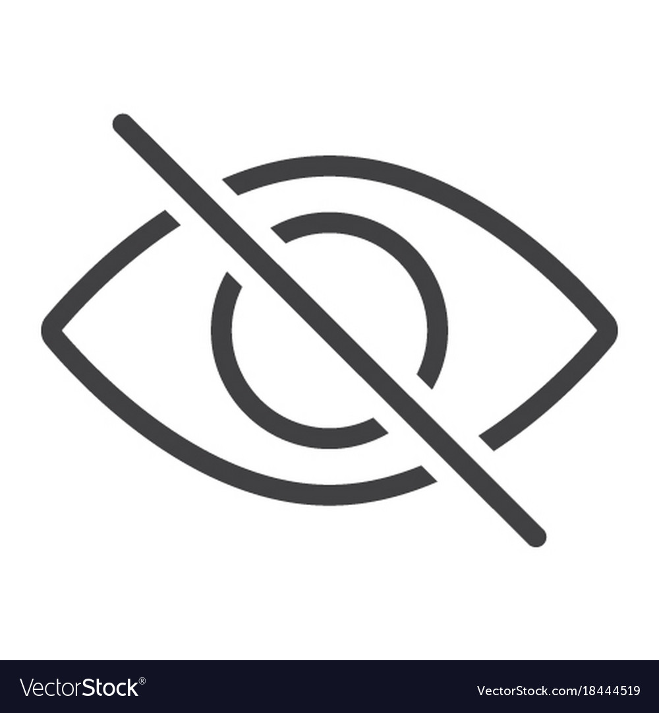

# Lorem Ipsum
is simply dummy text of the printing and typesetting industry. Lorem Ipsum has been the industry's standard dummy text ever since the 1500s, when an unknown printer took a galley of type and scrambled it to make a type specimen book. 
## Why do we use it?
It is a long established fact that a reader will be distracted by the readable content of a page when looking at its layout.
### Where does it come from?
Contrary to popular belief, Lorem Ipsum is not simply random text. It has roots in a piece of classical Latin literature from 45 BC, making it over 2000 years old. Richard McClintock, a Latin professor at Hampden-Sydney College in Virginia, looked up one of the more obscure Latin words, consectetur, from a Lorem Ipsum passage, and going through the cites of the word in classical literature, discovered the undoubtable source. Lorem Ipsum comes from sections 1.10.32 and 1.

quality attributes example:
1. scalability
2. reliability
3. safety
      
quality attributes example:
- scalability
- reliability
- safety

[Visit ASU](https://www.asu.edu.jo/en/Pages/default.aspx)

## Java User input
To read user input in java, use `Scanner s=new Scanner(System.in)`
Example:

    Scanner s=new Scanner(system.in)
    int value=s.nextInt()
   
| Name | Id |Major
|----------|----------|--------
| Asaad| 202111412|SE
|Abdallah|202111306|SE
|Alaa|202011402|Cs

---
> asaad aljammal in Asu

